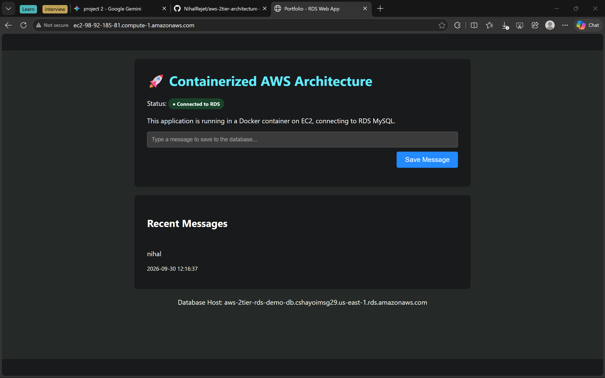
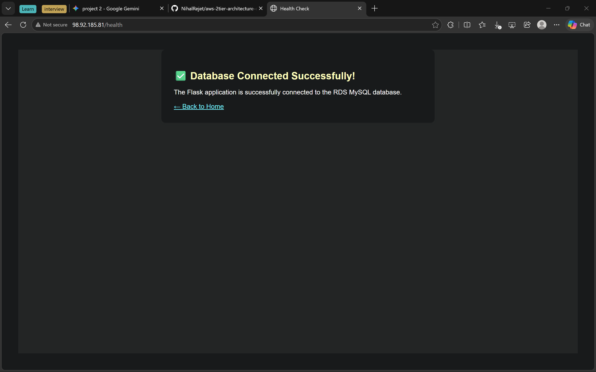

# AWS 2-Tier Architecture on Terraform

This repository contains the Infrastructure-as-Code (IaC) deployment for a secure, highly available 2-tier web application environment on AWS.

## Architecture Overview
* **Networking:** Custom VPC with logically isolated Public Subnets (Web Tier) and Private Subnets (Database Tier), utilizing an Internet Gateway and NAT Gateway for secure traffic routing.
* **Compute:** Auto-bootstrapped Ubuntu EC2 instance hosting a Python Flask application.
* **Database:** Amazon RDS MySQL 8.0 securely isolated from the public internet.
* **Security:** AWS Secrets Manager dynamically generates and injects database credentials into the compute tier, eliminating hardcoded passwords. Strict Security Group rules ensure database ingress is only permitted from the Web Tier.

## Deployment Instructions
1. Clone the repository and configure your AWS CLI credentials.
2. Initialize Terraform: `terraform init`
3. Review the execution plan: `terraform plan`
4. Provision the infrastructure: `terraform apply`

## Live Application Demo

